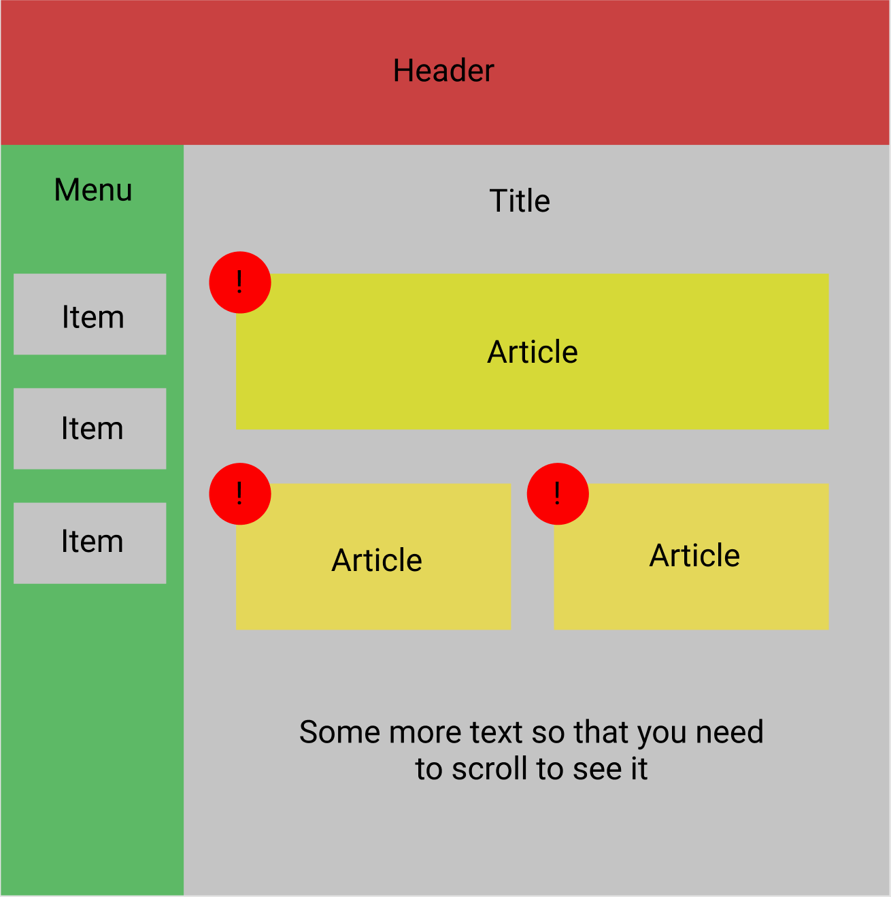

### **ДЗ 1** - deadline 23:59 18.04
Сверстать макет, прикрепленный ниже. Header и Menu должны всега присутствовать на экране и не двигаться при прокрутке. Все цвета, отступы и тд выбираете сами, макет примерный.
Для сдачи задания нужно отправить письмо на valery.statinov@gmail.com, указав тему письма «React_ВШЭ_весна_2021_ДЗ1» без ковычек, приложить к письму два файла: .html и .css (да, для сдачи этого задания не нужен гит).

Для загрузки .css файла в .html документ, открытый в браузере, в .html файле нужно указать
```html
<head>
  <link rel="stylesheet" href="yourCSSFile.css">
</head>
```

